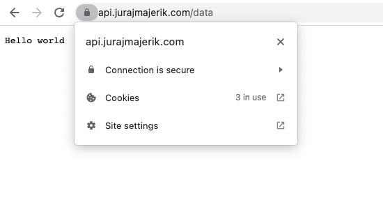

Let's enable HTTPS on our server. This will encrypt the data coming from and to our server.

First, we need to generate an SSL certificate. We can do this with [Let's Encrypt](https://letsencrypt.org/), a certification authority which issues SSL certificates for free. They offer a [Certbot client](https://certbot.eff.org/instructions?ws=other&os=ubuntufocal) for generating the certificate from the shell. Once I'm done, the certificates are stored on my server:
```
Successfully received certificate.
Certificate is saved at: /etc/letsencrypt/live/api.jurajmajerik.com/fullchain.pem
Key is saved at:         /etc/letsencrypt/live/api.jurajmajerik.com/privkey.pem
This certificate expires on 2023-01-21.
These files will be updated when the certificate renews.
Certbot has set up a scheduled task to automatically renew this certificate in the background.
```

Let's now revisit our server code stored on our local machine. We need to switch to the ```ListenAndServeTLS()``` method. We need to pass it the port number (433 for HTTPS), and the location of the certification file and the private key file.
```
http.ListenAndServeTLS(
  ":443",
  "/etc/letsencrypt/live/api.jurajmajerik.com/fullchain.pem",
  "/etc/letsencrypt/live/api.jurajmajerik.com/privkey.pem",
  nil,
)
```

Let's copy over the file to our server.
```
scp -r server juraj@api.jurajmajerik.com:~
```

Start the server with ```sudo go run main.go``` and head to the browser. If we go to ```https://api.jurajmajerik.com/data```, we can see the server is now serving our data securely.

